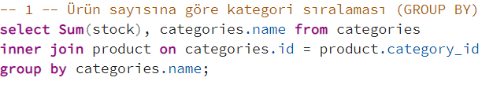
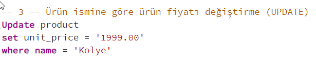
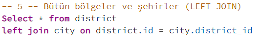
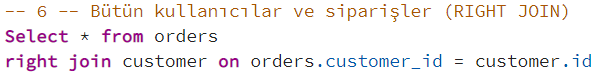

## Ürün sayısına göre kategori sıralaması (GROUP BY)

## A ve H arasındaki şehir isimleri (ORDER BY)

## Ürün ismine göre ürün fiyatı değiştirme (UPDATE)

## İçinde Fransa, Türkiye ve Arjantin olan adreslere sahip userlar (IN)

## Bütün bölgeler ve şehirler (LEFT JOIN)

## Bütün kullanıcılar ve siparişler (RIGHT JOIN)

## Renklerin ve ürünlerin hepsini (FULL OUTER JOIN)

