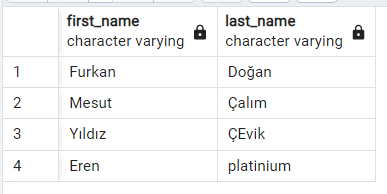
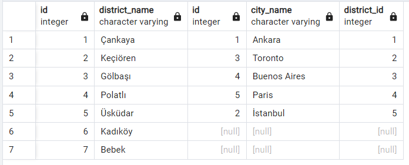
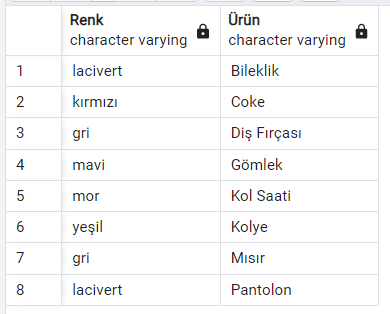

# 22.11.2022 SQL ÖDEV

## * Ürün sayısına göre kategori sıralaması (GROUP BY)
`select Sum(stock), categories.name from categories
inner join product on categories.id = product.category_id
group by categories.name;`

  

## * A ve H arasındaki şehir isimleri (ORDER BY)
`select * from city where city_name between 'A' and 'H' order by city_name`

  

  
## * Ürün ismine göre ürün fiyatı değiştirme (UPDATE)
`Update product set unit_price = '1999.00' where name = 'Kolye'`

  

  
## * İçinde Fransa, Türkiye ve Arjantin olan adreslere sahip userlar (IN)
`Select first_name,last_name from users
inner join address on users.address_id = address.id
inner join country on address.country_id = country.id
where country.country_name in ('Fransa', 'Türkiye', 'Arjantin')`

  

  
## * Bütün bölgeler ve şehirler (LEFT JOIN)
`Select * from district
left join city on district.id = city.district_id`

  

  
## * Bütün kullanıcılar ve siparişler (RIGHT JOIN)
`Select * from orders
right join customer on orders.customer_id = customer.id`

  

  
## * Renklerin ve ürünlerin hepsini (FULL OUTER JOIN)
`Select color.name as "Renk", product.name "Ürün" from product
full outer join color on product.color_id = color.id
order by product.name`

  

